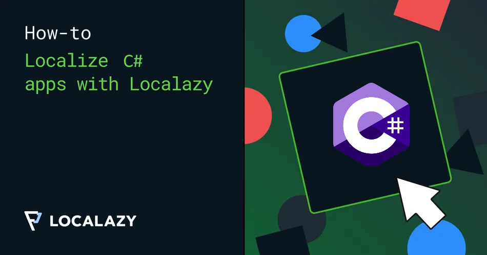

# How to localize a C# application with Localazy
### *Learn how to utilize Localazy to translate messages in any C# application*


Localization is a key element for distributing your application across borders.


The SDK is close modelled after [Localazy's API](https://localazy.com/docs/api/introduction)

## How to use the SDK
### 1) Install the NuGet package
https://www.nuget.org/packages/Localazy.Sdk
```bash
dotnet add package Localazy.Sdk
```


### 2) Add the SDK to the service provider
```csharp
using Localazy;

// Setup
var apiKey = builder.Configuration["Localazy:ApiKey"];
builder.Services.AddLocalazySdk(apiKey);
```

### 3) Import your files to Localazy

```csharp
private async Task ImportToFile(string fileName, List<KeyValuePair<string, string>> sourceStrings)
    {
        await localazyService.ImportContentToProject(ProjectId, new ImportContentRequest
            {
                ForceCurrent = true,
                Files = new ImportFile
                {
                    Name = file.FileName,
                    Content = new ImportContent
                    {
                        LanguageMap = new Dictionary<string, object>
                        {
                            {
                                file.SourceLanguageCode, new ImportLanguage
                                {
                                    Messages = sourceStrings.ToDictionary(
                                        k => k.Path,
                                        v => v.OriginalText as object
                                    )
                                }
                            }
                        }
                    }
                }.AsList()
            }
        );
    }
```